## DNA Engineering Full-Stack Assignment
Build a CSV Parser.

## Project Structure
```
Full-Stack-Internship-Home-Assignment

  |__ backend
        |__ src
            |__ main
                |__ java/ma/dnaengineering/backend
                    |__ dto
                        |__ EmployeeDTO.java
                        |__ SalarySummaryDTO.java
                    |__ entities
                        |__ Employee.java
                    |__ repository  
                        |__ EmployeeRepository.java
                    |__ service
                        |__ EmployeeService.java
                    |__ web
                        |__ EmployeeController.java
                    |__ BackendApplication.java
                |__ resources
                    |__ application.properties

  |__ data
        |__ csv files

  |__ frontend
        |__ public
        |__ src
            |__ components
                |__ EmployeeComponent.js
                |__ FileUploadComponent.js
                |__ SalarySummaryComponent.js
            |__ helpers
                |__ Utils.js
            |__ pages
                |__ api
                |__ _app.js
                |__ index.js
            |__ styles
                |__ global.css
            |__ package.json
            |__ ...
         
```
<br>

## Project Architecture
1. User selects a file, clicks "Upload," and the file is sent to the backend via a POST request with Rest API.
2. Backend parses and saves the data, then returns a success response, now the "Process" button becomes enabled, and the user can click it.
3. After clicking on the button, frontend sends a request to process data. Backend retrieves, processes, and returns the result.
4. Frontend displays the result in two tables.
<br>
As shown in the following table : 
<table align="center">
  <tr>
    <th>Upload</th>
    <th>Process & Display Tables</th>
  </tr>
  <tr>
    <td>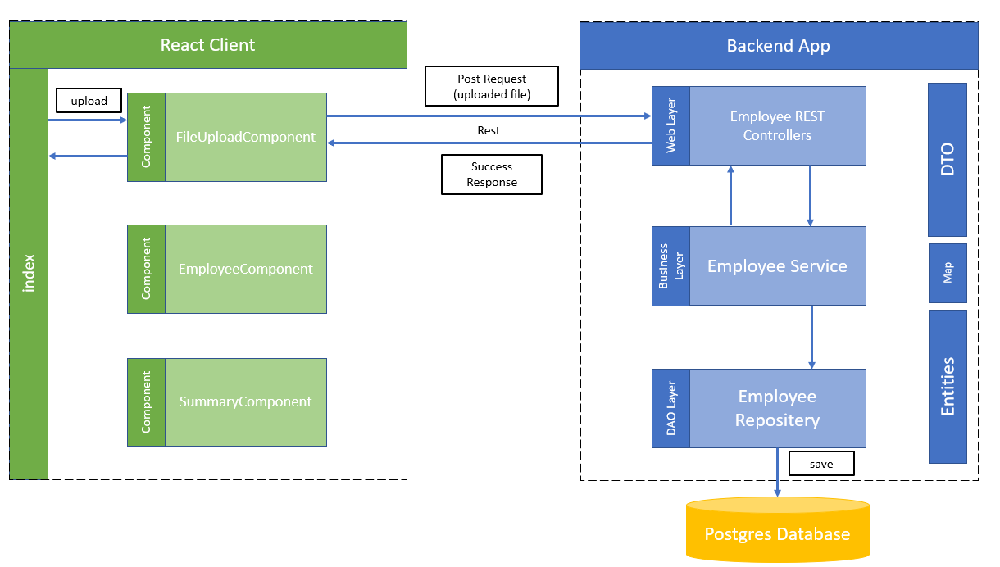</td>
    <td>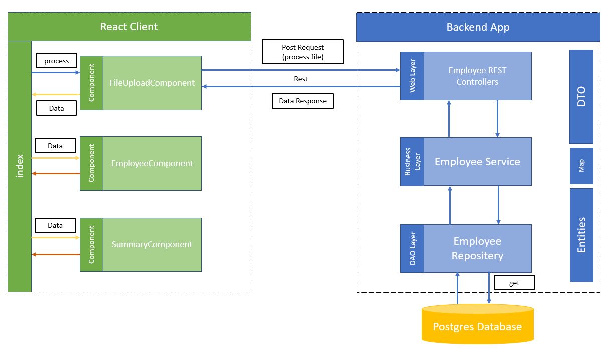</td>
  </tr>
</table>
<br>

## Backend
### 1. Test the Service
```java
@ExtendWith(MockitoExtension.class)
public class EmployeeServiceTest {

    @Mock
    private EmployeeRepository employeeRepository;
    @InjectMocks
    private EmployeeService employeeService;
    @Test
    public void whenParseCSVFile_thenCorrectlySaveEmployees() throws Exception {
        String csvContent = "ID,employeeName,JobTitle,Salary\n1,John Doe,Developer,70000\n2,Jane Doe,Developer,80000";
        InputStream is = new ByteArrayInputStream(csvContent.getBytes());
        MultipartFile mockFile = new MockMultipartFile("file", "test.csv", "text/csv", is);

        employeeService.parseCSVFile(mockFile);

        verify(employeeRepository, times(2)).save(any(Employee.class));
    }
    @Test
    public void whenCalculateAverageSalary_thenCorrectResult() {

        List<Employee> employees = Arrays.asList(
                new Employee(1, "John Doe", "Developer", 70000.0),
                new Employee(2, "Jane Doe", "Developer", 80000.0),
                new Employee(3, "Jim Beam", "Manager", 90000.0)
        );

        Map<String, SalarySummaryDTO> result = employeeService.calculateAverageSalary(employees);
        
        assertThat(result).hasSize(2);
        assertThat(result.get("Developer").getAverageSalary()).isEqualTo(75000.0);
        assertThat(result.get("Manager").getAverageSalary()).isEqualTo(90000.0);
    }
}
```
<div align="center">
  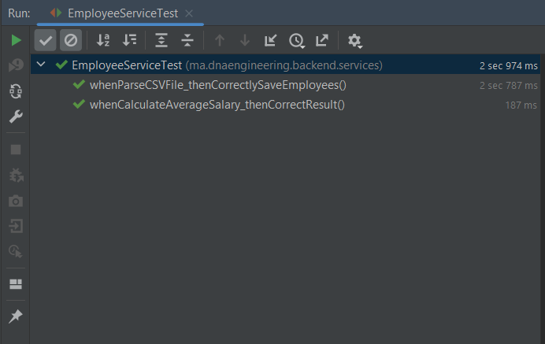
</div>

### 2. Test with Postman
<table align="center">
  <tr>
    <th>Upload</th>
    <th>Process</th>
  </tr>
  <tr>
    <td>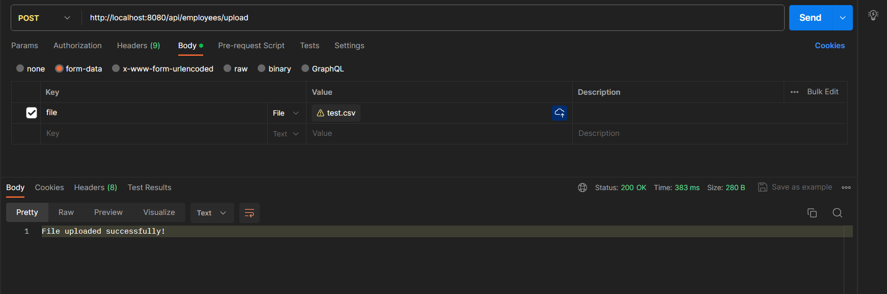</td>
    <td>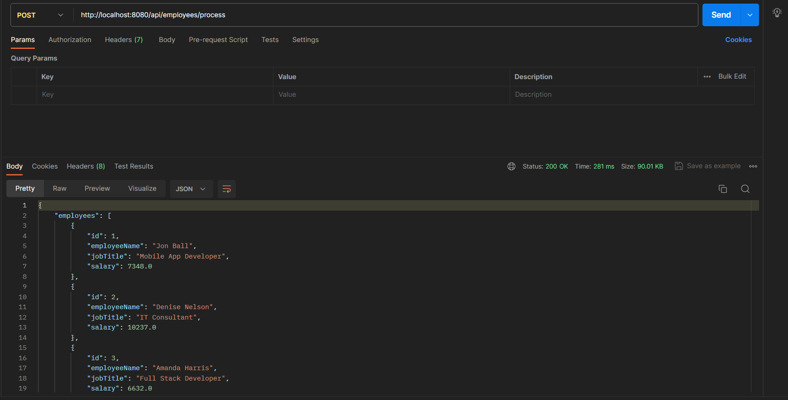</td>
  </tr>
</table>
<br>

## Frontend
<table align="center">
  <tr>
    <th>Upload</th>
    <th>Upload Dialogue</th>
  </tr>
  <tr>
    <td>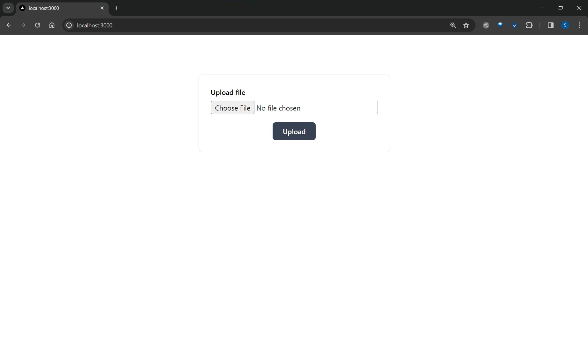</td>
    <td>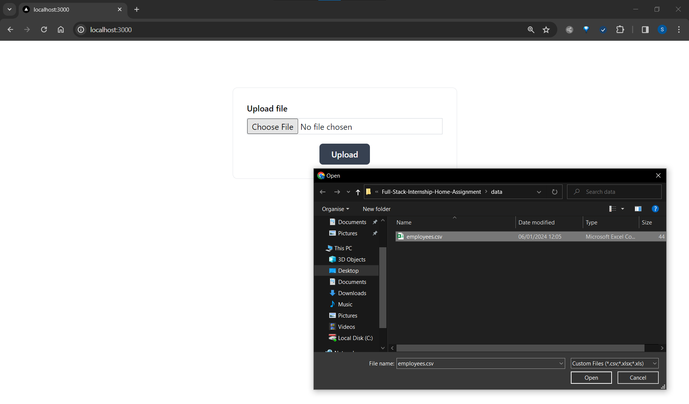</td>
  </tr>
  <tr>
    <th>Process</th>
    <th>Display Tables</th>
  </tr>
  <tr>
    <td>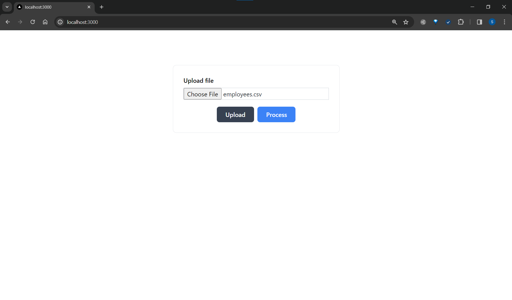</td>
    <td>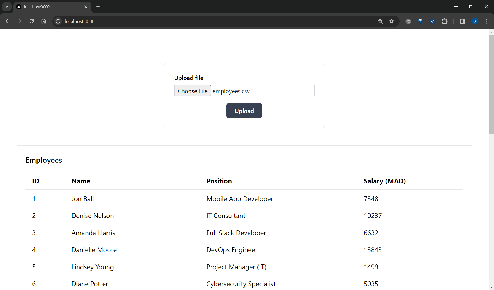</td>
  </tr>
  <tr>
    <th>Employee Table</th>
    <th>Average Salary Table</th>
  </tr>
  <tr>
    <td>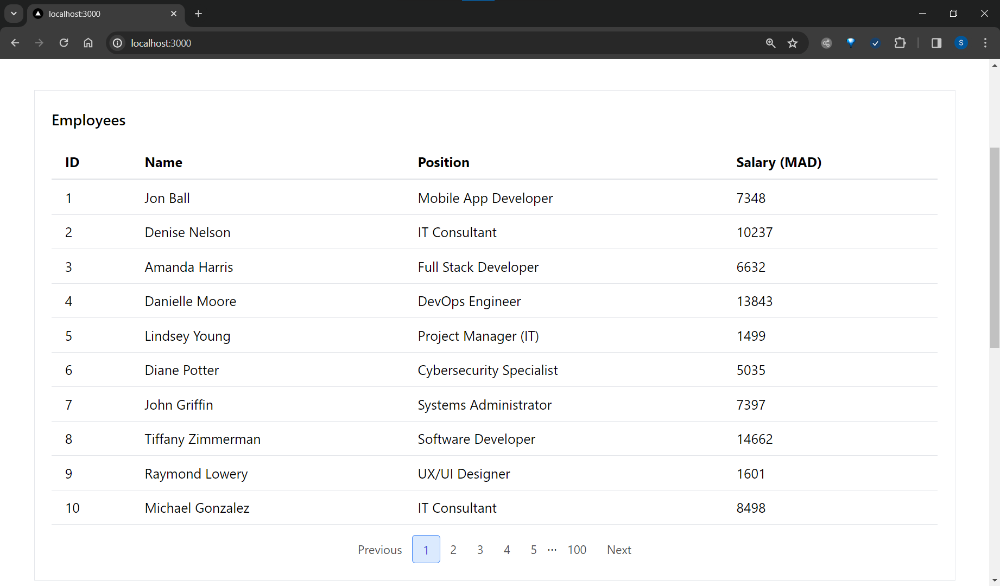</td>
    <td>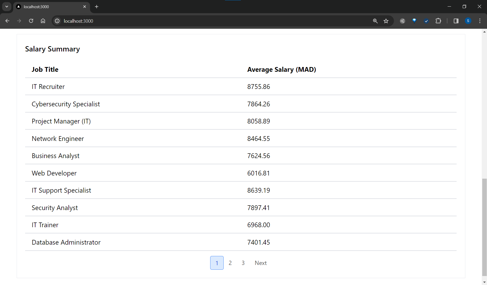</td>
  </tr>
</table>
<br>